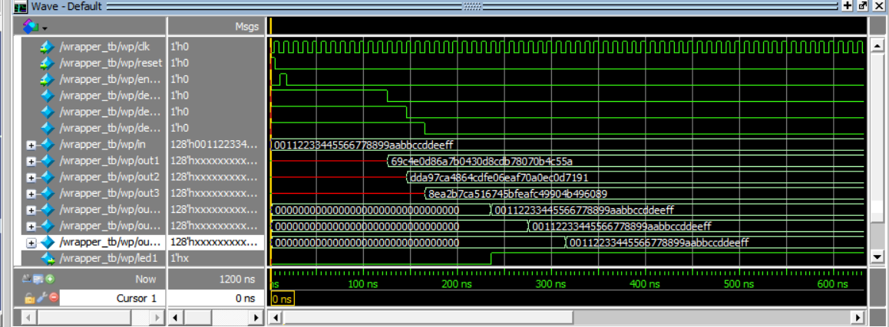

# AES
Verilog AES ([Advanced Encryption Standard](https://www.nist.gov/publications/advanced-encryption-standard-aes)) implementation

## About
there's two chippers one for encryption and other for decryption
#### Key Lengths
- 128 bit
- 192 bit
- 256 bit

## encipher
- #### parameters
  - Nk (number of words in key)
- #### inputs 
  - clk (clock)
  - reset
  - enable 
  - load (input text)
  - key 
- #### outputs 
  - out (encrypted text)
  - decReset (to reset the decipher when new input in) for test only
  
## decipher
- #### parameters
  - Nk (number of words in key)
- #### inputs 
  - clk (clock)
  - decReset (reset come from encipher)
  - in (input text)
  - key 
- #### outputs 
  - out (decrypted text)
  
## Tests 
- the chippers tested on FPGA
- all testbenches included 
- tests we used in wrapper:

      input: 00112233445566778899aabbccddeeff

      🔑 128_key: 000102030405060708090a0b0c0d0e0f
      🔒 output: 69c4e0d86a7b0430d8cdb78070b4c55a

      🔑 192_key: 000102030405060708090a0b0c0d0e0f1011121314151617
      🔒 output: dda97ca4864cdfe06eaf70a0ec0d7191

      🔑 256_key: 000102030405060708090a0b0c0d0e0f101112131415161718191a1b1c1d1e1f
      🔒 output: 8ea2b7ca516745bfeafc49904b496089

 
#### wrapper_tb wave screenshot

## My Teammates
- [@Mahmoud-Abdel-Motaleb](https://github.com/Mahmoud-Abdel-Motaleb)
- [@Aly-Abdel-Motaleb](https://github.com/Aly-Abdel-Motaleb)
- [@Omar-Said-4](https://github.com/Omar-Said-4)
